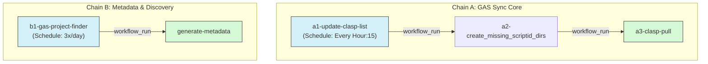

# GitHub Actions Workflow Analysis

This repository uses GitHub Actions to automatically sync Google Apps Script (GAS) projects and maintain meta-information. All workflows primarily operate on the **`gas-pull`** branch.

## Workflow Execution Chains

### Chain A: GAS Repository Sync (Main Chain)
This chain is responsible for discovering all current GAS projects and pulling their source code into the repository.

1.  **[a1-update-clasp-list.yml](a1-update-clasp-list.yml)**
    - **Trigger**: Hourly schedule (`15 * * * *`) or manual dispatch.
    - **Action**:
        - Authenticates using `CLASPRC_JSON` secret.
        - Executes `clasp list` to fetch all script names and IDs.
        - Runs `parse_clasp_list.py` to convert the raw text into structured JSON.
    - **Output**:
        - `clasp-list.txt`: Raw output from `clasp list`.
        - `clasp-list.json`: Structured array of `{ "name": "...", "id": "..." }`.
    - **Commit Logic**: Force-pushes to `gas-pull` branch if changes are detected in `clasp-list.txt`.
    - **Next**: Triggers `a2-create_missing_scriptid_dirs`.

2.  **[a2-create_missing_scriptid_dirs.yml](a2-create_missing_scriptid_dirs.yml)**
    - **Trigger**: Completion of `a1-update-clasp-list`.
    - **Action**: Runs `create_missing_scriptid_dirs.py` using `clasp-list.txt`.
    - **Output**:
        - Creates new subdirectories named by `ScriptID`.
        - Initializes `.clasp.json` in each new directory.
    - **Next**: Triggers `a3-clasp-pull`.

3.  **[a3-clasp-pull.yml](a3-clasp-pull.yml)**
    - **Trigger**: Completion of `a2-create_missing_scriptid_dirs`.
    - **Action**: Runs `clasp-pull.py`.
    - **Output**: 
        - Synchronizes GAS source files.
        - Fetches and saves deployment and version historical data.
    - **Next**: (End of Chain A)

---

### Chain B: Discovery & Metadata
This chain fetches external tracking data and ensures directory-level metadata is up to date.

1.  **[b1-gas-project-finder.yml](b1-gas-project-finder.yml)**
    - **Trigger**: 3 times daily (`45 8,16,0 * * *`) or manual dispatch.
    - **Action**: Fetches remote tracking data from a web app.
    - **Output**: Updates `gas-project-finder.json`.
    - **Next**: Triggers `generate-metadata`.

2.  **[generate-metadata.yml](generate-metadata.yml)**
    - **Trigger**: Completion of `b1-gas-project-finder`.
    - **Action**: Runs `manifest.py`.
    - **Output**: Updates `metadata.json` files within each project directory.

---

## Summary Diagram

---

## Detailed Component Analysis

### a1-update-clasp-list.yml
This workflow is the "heart" of the synchronization process. It ensures the repository knows about every project in the Google account.

#### Inputs & Dependencies
- **Secrets**: `CLASPRC_JSON` — Contains the OAuth2 credentials required for `clasp` to access the Google account.
- **Tools**:
  - `clasp` (Node.js): Used to communicate with the Google Apps Script API.
  - `python3`: Used to run the parsing script.

#### Execution Steps
1. **Checkout**: Checks out the `gas-pull` branch.
2. **Setup**: Installs Node.js and the `clasp` CLI globally.
3. **Auth**: Restores the credentials from secrets to `~/.clasprc.json`.
4. **List**: Runs `clasp list`, which outputs a plain-text list of all scripts.
5. **Parse**: `parse_clasp_list.py` reads `clasp-list.txt` and uses regex to extract the script names and IDs, saving them as a JSON array.
6. **Deploy**: If `clasp-list.txt` has changed (meaning a script was added, renamed, or deleted), it commits and **force-pushes** the updates to `gas-pull`.

#### Generated Artifacts
| File | Format | Description |
| :--- | :--- | :--- |
| `clasp-list.txt` | Text | The direct output of `clasp list`. Includes the count of scripts and URLs per line. |
| `clasp-list.json` | JSON | A clean array of objects `[{"name": "...", "id": "..."}]` used by downstream scripts. |

---

### a2-create_missing_scriptid_dirs.yml
This workflow prepares the filesystem for new projects discovered in the previous step.

#### Inputs & Dependencies
- **Primary Input**: `clasp-list.txt` — The raw text output from the `a1-update-clasp-list` workflow containing names and script URLs.
- **State Dependency**:
  - Existing subdirectories in the repository root.
  - `.clasp.json` files within those subdirectories to extract currently tracked `scriptId`s.
- **Tools**: `python3` — Executes the directory creation and configuration logic.

#### Execution Steps
1. **Directory Scanning**: Scans all subdirectories in the repository to identify which `ScriptIDs` are already tracked (by reading their `.clasp.json`).
2. **Identification**: Compares the `ScriptIDs` in `clasp-list.txt` against the tracked ones.
3. **Creation**: For each missing `ScriptID`:
   - Creates a new directory named exactly as the `ScriptID`.
   - Writes a minimal `.clasp.json` file: `{"scriptId": "[SCRIPT_ID]"}`.
4. **Git Push**: Commits the new directories and `.clasp.json` files to the `gas-pull` branch.

#### Generated Artifacts
| Item | Description |
| :--- | :--- |
| `{SCRIPT_ID}/` | A new directory for each newly discovered GAS project. |
| `{SCRIPT_ID}/.clasp.json` | Configuration file enabling `clasp` to know which remote script to pull into this directory. |

---

### a3-clasp-pull.yml
This workflow is responsible for the actual synchronization of code and metadata for all tracked projects.

#### Inputs & Dependencies
- **Secrets**: `CLASPRC_JSON` — For authentication and API access.
- **Filesystem**: Requires project directories containing `.clasp.json`.
- **API Access**: Communicates with the Google Apps Script API to check for updates.

#### Execution Steps
1. **Optimization Check**: For each directory, it fetches the remote `updateTime` from the GAS API and compares it with the local `lastUpdated` timestamp in `metadata.json`.
2. **Conditional Pull**: If the remote version is newer (or local metadata is missing):
   - Runs `clasp pull` to update the source code (e.g., `Code.js`, `index.html`, `appsscript.json`).
   - Runs `clasp deployments` to generate `deployments.txt` and `deployments.json`.
   - Runs `clasp versions` to generate `versions.txt` and `versions.json`.
3. **Metadata Update**: Updates `metadata.json` with the new `lastUpdated` timestamp.
4. **Git Push**: Commits all code and metadata changes to the `gas-pull` branch.

#### Generated Artifacts (per project)
| File | Format | Description |
| :--- | :--- | :--- |
| `*.js`, `*.html` | Source | The actual Google Apps Script code. |
| `appsscript.json` | JSON | The GAS manifest file. |
| `deployments.json` | JSON | Structured list of all deployments (ID, version, description). |
| `versions.json` | JSON | Structured list of all project versions. |
| `metadata.json` | JSON | Contains the `lastUpdated` sync timestamp. |

---

### b1-gas-project-finder.yml
This workflow fetches high-level project metadata from an external Google Apps Script web app.

#### Inputs & Dependencies
- **Remote API**: A specific GAS web app URL that returns project discovery data in JSON format.
- **Filesystem State**: Reads the existing `gas-project-finder.json` (if any) to perform a comparison and determine if an update/commit is necessary.

#### Execution Steps
1. **Fetch**: Uses `curl` to retrieve JSON data from the remote endpoint.
2. **Comparison**: Compares the retrieved JSON with the local `gas-project-finder.json`.
3. **Update**: If differences are found, overwrites the local file with the new data.
4. **Git Push**: Commits the updated `gas-project-finder.json` to the `gas-pull` branch.

#### Generated Artifacts
| File | Format | Description |
| :--- | :--- | :--- |
| `gas-project-finder.json` | JSON | Master tracking list of all projects and their high-level metadata from the external source. |

---

### generate-metadata.yml
This workflow compiles various data sources into a per-directory `metadata.json` for easy access by other tools or the UI.

#### Inputs & Dependencies
- **Discovery Data**: `gas-project-finder.json` (the output of the previous workflow).
- **Filesystem State**:
  - Scans for project directories containing `.clasp.json` (to get the `scriptId`).
  - Reads `application.json` (if present in the project directory).
  - Reads `deployments.json` (if present in the project directory).
- **Tools**: `python3` — Executes `manifest.py`.

#### Execution Steps
1. **Walk**: Recursively walks through the repository to find project directories.
2. **Consolidate**: For each project, merges data from:
   - `gas-project-finder.json` (using the `scriptId` as a key).
   - Local `application.json`.
   - Local `deployments.json`.
3. **Output**: Writes the combined dictionary to `metadata.json` within the project folder.
4. **Git Push**: Commits all modified `metadata.json` files to the `gas-pull` branch.

#### Generated Artifacts
| File | Format | Description |
| :--- | :--- | :--- |
| `{SCRIPT_ID}/metadata.json` | JSON | Consolidated metadata file for a specific project, combining remote discovery info and local state. |

---

## Maintenance Notes
- All changes are pushed to the **`gas-pull`** branch by `github-actions[bot]`.
- Failure in an upstream workflow (e.g., `a1-update-clasp-list`) will prevent downstream workflows from running (conditions check for `conclusion == 'success'`).
- Manual runs via `workflow_dispatch` are available for all components.
